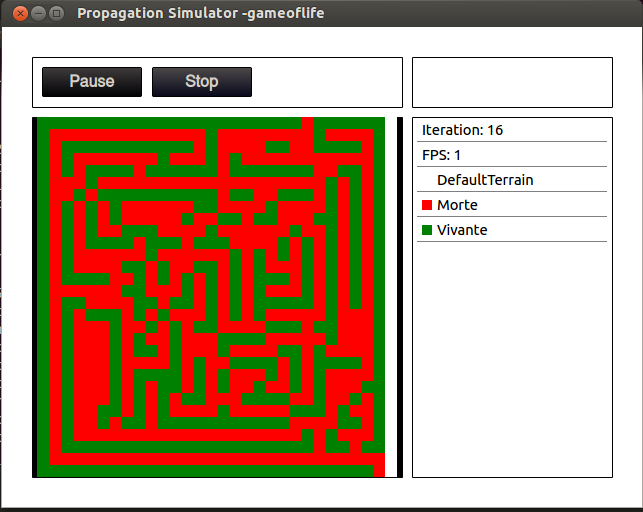

# Propagation simulator

This is the group project for my last undergraduate course semester. The wonderful member of this project are listed in _docs_.

- _propsim_ Contains the sources for the simulator.
- _generate_ Contains a tool to help you generate the configuration files for a simulation.
- _docs_ Contains the specifications, user manual, installation manual and project report (in french 🐸).
- _images_ Contains the logo and a few examples.

# Sampl
